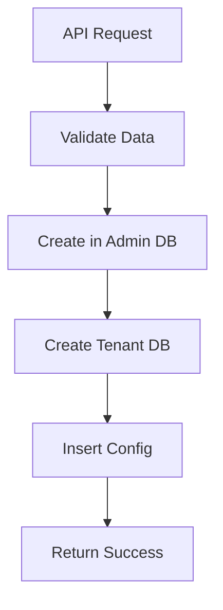
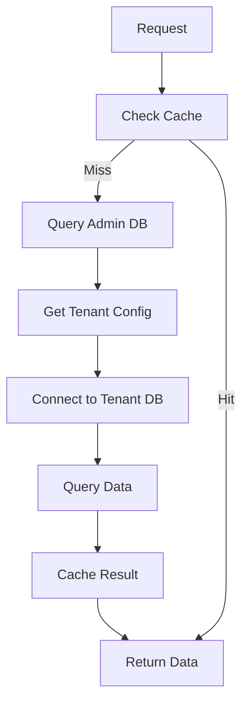

# Руководство по Реализации Мультитенантной Платформы "Мессия"
**Функциональный подход с коннекторами**

**Дата:** 24 июля 2025  
**Архитектура:** Admin DB (Supabase) + Tenant DB (per-tenant) + Коннекторы  
**Стиль:** Чистые функции, без классов

---

## 📋 Содержание
1. [Общая Архитектура](#общая-архитектура)
2. [Структура Admin DB](#структура-admin-db)
3. [Структура Tenant DB](#структура-tenant-db)
4. [Функциональные Коннекторы](#функциональные-коннекторы)
5. [SQL Скрипты](#sql-скрипты)
6. [Flow Работы](#flow-работы)
7. [Расширяемые Поля](#расширяемые-поля)
8. [Кэширование](#кэширование)
9. [Мониторинг](#мониторинг)

---

## 🔧 Общая Архитектура

```
┌─────────────────────────────────────────┐
│           API Gateway                   │
├─────────────────────────────────────────┤
│        Tenant Management                │
│   (чистые функции, без состояния)       │
├─────────────────────────────────────────┤
│  Admin DB (Supabase)  │  Tenant DB     │
│  - tenants            │  (per-tenant)  │
│  - configs            │  - данные      │
│  - extensible_fields  │  - настройки   │
└─────────────────────────────────────────┘
```

### Основные принципы:
- **Функциональный стиль**: Всё через чистые функции
- **Коннекторы**: Унифицированный доступ к разным БД
- **Абстракция**: Repository pattern через функции
- **Кэширование**: На уровне сервиса

---

## 🏗️ Структура Admin DB (Supabase)

### Основные таблицы:

```sql
-- Таблица тенантов
create table tenants (
  id uuid primary key default gen_random_uuid(),
  tenant_id text unique not null,
  name text not null,
  slug text unique not null,
  status text check (status in ('active', 'inactive', 'suspended')) default 'active',
  contact_email text,
  contact_name text,
  settings jsonb default '{}',
  created_at timestamptz default now(),
  updated_at timestamptz default now()
);

-- Таблица конфигураций Supabase для тенантов
create table tenant_supabase_configs (
  id uuid primary key default gen_random_uuid(),
  tenant_id text references tenants(tenant_id) on delete cascade,
  supabase_project_id text not null,
  supabase_url text not null,
  anon_key text not null,
  service_key text not null,
  region text default 'us-east-1',
  plan text check (plan in ('free', 'pro', 'team', 'enterprise')) default 'free',
  is_active boolean default true,
  created_at timestamptz default now(),
  updated_at timestamptz default now()
);

-- Расширяемые поля
create table extension_field_definitions (
  id bigserial primary key,
  tenant_id text references tenants(tenant_id) on delete cascade,
  entity_table text not null,
  field_name text not null,
  field_type text check (field_type in ('text', 'number', 'boolean', 'date', 'json', 'select')),
  display_name text not null,
  description text,
  is_required boolean default false,
  is_searchable boolean default true,
  is_filterable boolean default true,
  is_sortable boolean default false,
  default_value text,
  validation_rules jsonb default '{}',
  ui_config jsonb default '{}',
  is_active boolean default true,
  created_at timestamptz default now(),
  updated_at timestamptz default now(),
  unique(tenant_id, entity_table, field_name)
);

-- Индексы
create index idx_tenants_status on tenants(status);
create index idx_tenants_slug on tenants(slug);
create index idx_tenant_configs_tenant on tenant_supabase_configs(tenant_id);
create index idx_extension_fields_tenant on extension_field_definitions(tenant_id, entity_table);
```

---

## 🏢 Структура Tenant DB (per-tenant)

### Для каждого тенанта создается отдельная БД:

```sql
-- Создание БД для тенанта
create database tenant_{tenant_id};

-- Внутри tenant DB:
create table clients (
  id uuid primary key default gen_random_uuid(),
  name text not null,
  email text unique,
  phone text,
  custom_fields jsonb default '{}',
  created_at timestamptz default now(),
  updated_at timestamptz default now()
);

create table projects (
  id uuid primary key default gen_random_uuid(),
  client_id uuid references clients(id),
  name text not null,
  status text default 'active',
  custom_fields jsonb default '{}',
  created_at timestamptz default now(),
  updated_at timestamptz default now()
);

create table activities (
  id uuid primary key default gen_random_uuid(),
  project_id uuid references projects(id),
  type text not null,
  description text,
  custom_fields jsonb default '{}',
  created_at timestamptz default now()
);
```

---

## 🔌 Функциональные Коннекторы

### Фабрика коннекторов:

```typescript
// src/services/tenant-management/src/connectors/factory.ts
import { createSupabaseConnector } from './supabase';
import { createPostgresConnector } from './postgres';
import type { DatabaseConnector } from './types';

export type ConnectorType = 'supabase' | 'postgres' | 'mongodb';

export type DatabaseConfig = {
  type: ConnectorType;
  url: string;
  key?: string;
  database?: string;
};

export type DatabaseConnector = {
  query: (sql: string, params?: any[]) => Promise<any[]>;
  insert: (table: string, data: Record<string, any>) => Promise<any>;
  update: (table: string, data: Record<string, any>, where: Record<string, any>) => Promise<any>;
  delete: (table: string, where: Record<string, any>) => Promise<any>;
  close: () => Promise<void>;
};

export const createConnector = (config: DatabaseConfig): DatabaseConnector => {
  switch (config.type) {
    case 'supabase':
      return createSupabaseConnector(config);
    case 'postgres':
      return createPostgresConnector(config);
    default:
      throw new Error(`Unsupported connector type: ${config.type}`);
  }
};
```

### Supabase коннектор:

```typescript
// src/services/tenant-management/src/connectors/supabase.ts
import { createClient, SupabaseClient } from '@supabase/supabase-js';
import type { DatabaseConnector, DatabaseConfig } from './types';

export const createSupabaseConnector = (config: DatabaseConfig): DatabaseConnector => {
  const client: SupabaseClient = createClient(config.url, config.key!);
  
  return {
    query: async (sql: string, params?: any[]) => {
      const { data, error } = await client.rpc('exec_sql', { sql, params });
      if (error) throw error;
      return data;
    },
    
    insert: async (table: string, data: Record<string, any>) => {
      const { data: result, error } = await client.from(table).insert(data).select().single();
      if (error) throw error;
      return result;
    },
    
    update: async (table: string, data: Record<string, any>, where: Record<string, any>) => {
      const { data: result, error } = await client.from(table).update(data).match(where).select();
      if (error) throw error;
      return result;
    },
    
    delete: async (table: string, where: Record<string, any>) => {
      const { error } = await client.from(table).delete().match(where);
      if (error) throw error;
    },
    
    close: async () => {
      // Supabase клиент не требует закрытия
    }
  };
};
```

---

## 📊 SQL Скрипты

### Скрипт инициализации Admin DB:

```sql
-- init_admin_db.sql
-- Запускать один раз при создании платформы

-- Создание схемы
CREATE SCHEMA IF NOT EXISTS tenant_management;

-- Таблица tenants
CREATE TABLE IF NOT EXISTS tenants (
  id UUID PRIMARY KEY DEFAULT gen_random_uuid(),
  tenant_id TEXT UNIQUE NOT NULL,
  name TEXT NOT NULL,
  slug TEXT UNIQUE NOT NULL,
  status TEXT CHECK (status IN ('active', 'inactive', 'suspended')) DEFAULT 'active',
  contact_email TEXT,
  contact_name TEXT,
  settings JSONB DEFAULT '{}',
  created_at TIMESTAMPTZ DEFAULT now(),
  updated_at TIMESTAMPTZ DEFAULT now()
);

-- Таблица конфигураций
create table if not exists tenant_supabase_configs (
  id uuid primary key default gen_random_uuid(),
  tenant_id text references tenants(tenant_id) on delete cascade,
  supabase_project_id text not null,
  supabase_url text not null,
  anon_key text not null,
  service_key text not null,
  region text default 'us-east-1',
  plan text check (plan in ('free', 'pro', 'team', 'enterprise')) default 'free',
  is_active boolean default true,
  created_at timestamptz default now(),
  updated_at timestamptz default now()
);

-- Расширяемые поля
create table if not exists extension_field_definitions (
  id bigserial primary key,
  tenant_id text references tenants(tenant_id) on delete cascade,
  entity_table text not null,
  field_name text not null,
  field_type text check (field_type in ('text', 'number', 'boolean', 'date', 'json', 'select')),
  display_name text not null,
  description text,
  is_required boolean default false,
  is_searchable boolean default true,
  is_filterable boolean default true,
  is_sortable boolean default false,
  default_value text,
  validation_rules jsonb default '{}',
  ui_config jsonb default '{}',
  is_active boolean default true,
  created_at timestamptz default now(),
  updated_at timestamptz default now(),
  unique(tenant_id, entity_table, field_name)
);

-- Индексы для производительности
CREATE INDEX IF NOT EXISTS idx_tenants_status ON tenants(status);
CREATE INDEX IF NOT EXISTS idx_tenants_slug ON tenants(slug);
CREATE INDEX IF NOT EXISTS idx_tenant_configs_tenant ON tenant_supabase_configs(tenant_id);
CREATE INDEX IF NOT EXISTS idx_extension_fields_tenant ON extension_field_definitions(tenant_id, entity_table);
```

### Скрипт создания tenant DB:

```sql
-- create_tenant_db.sql
-- Запускать для каждого нового тенанта

-- Создание БД
CREATE DATABASE tenant_{tenant_id};

-- Подключение к новой БД
\c tenant_{tenant_id}

-- Создание таблиц
CREATE EXTENSION IF NOT EXISTS "uuid-ossp";

CREATE TABLE IF NOT EXISTS clients (
  id UUID PRIMARY KEY DEFAULT uuid_generate_v4(),
  name TEXT NOT NULL,
  email TEXT UNIQUE,
  phone TEXT,
  custom_fields JSONB DEFAULT '{}',
  created_at TIMESTAMPTZ DEFAULT now(),
  updated_at TIMESTAMPTZ DEFAULT now()
);

CREATE TABLE IF NOT EXISTS projects (
  id UUID PRIMARY KEY DEFAULT uuid_generate_v4(),
  client_id UUID REFERENCES clients(id) ON DELETE CASCADE,
  name TEXT NOT NULL,
  status TEXT DEFAULT 'active',
  custom_fields JSONB DEFAULT '{}',
  created_at TIMESTAMPTZ DEFAULT now(),
  updated_at TIMESTAMPTZ DEFAULT now()
);

CREATE TABLE IF NOT EXISTS activities (
  id UUID PRIMARY KEY DEFAULT uuid_generate_v4(),
  project_id UUID REFERENCES projects(id) ON DELETE CASCADE,
  type TEXT NOT NULL,
  description TEXT,
  custom_fields JSONB DEFAULT '{}',
  created_at TIMESTAMPTZ DEFAULT now()
);

-- Индексы для tenant DB
CREATE INDEX IF NOT EXISTS idx_clients_email ON clients(email);
CREATE INDEX IF NOT EXISTS idx_projects_client ON projects(client_id);
CREATE INDEX IF NOT EXISTS idx_activities_project ON activities(project_id);
CREATE INDEX IF NOT EXISTS idx_custom_fields ON clients USING gin(custom_fields);
CREATE INDEX IF NOT EXISTS idx_custom_fields_projects ON projects USING gin(custom_fields);
```

---

## 🔄 Flow Работы

### 1. Создание нового тенанта:



### 2. Получение данных тенанта:



### Функциональный flow:

```typescript
// src/services/tenant-management/src/flows/createTenant.ts
import { createConnector } from '../connectors/factory';
import { createCacheService } from '../cache';

export const createTenantFlow = async (tenantData: CreateTenantData) => {
  const adminConnector = createConnector({
    type: 'supabase',
    url: process.env.ADMIN_SUPABASE_URL!,
    key: process.env.ADMIN_SERVICE_KEY!
  });
  
  const cache = createCacheService({ ttl: 600000 });
  
  try {
    // 1. Создать тенант в Admin DB
    const tenant = await adminConnector.insert('tenants', tenantData);
    
    // 2. Создать tenant DB
    await createTenantDatabase(tenant.tenant_id);
    
    // 3. Добавить конфигурацию
    await adminConnector.insert('tenant_supabase_configs', {
      tenant_id: tenant.tenant_id,
      ...tenantData.config
    });
    
    // 4. Инвалидировать кэш
    cache.clear();
    
    return { success: true, tenant };
  } catch (error) {
    return { success: false, error: error.message };
  }
};
```

---

## 🔧 Расширяемые Поля

### Функциональная реализация:

```typescript
// src/services/tenant-management/src/extensibleFields.ts
export type ExtensibleField = {
  tenant_id: string;
  entity_table: string;
  field_name: string;
  field_type: 'text' | 'number' | 'boolean' | 'date' | 'json' | 'select';
  display_name: string;
  validation_rules: Record<string, any>;
  is_required: boolean;
};

export const createExtensibleFieldService = (adminConnector: DatabaseConnector) => ({
  getFields: async (tenantId: string, entityTable: string) => {
    const fields = await adminConnector.query(
      `SELECT * FROM extension_field_definitions 
       WHERE tenant_id = $1 AND entity_table = $2 AND is_active = true`,
      [tenantId, entityTable]
    );
    return fields;
  },
  
  validateField: (field: any, definition: ExtensibleField) => {
    const rules = definition.validation_rules;
    
    if (definition.is_required && !field) {
      return { valid: false, error: 'Field is required' };
    }
    
    if (rules.minLength && field.length < rules.minLength) {
      return { valid: false, error: `Minimum length is ${rules.minLength}` };
    }
    
    return { valid: true };
  },
  
  applyFields: (data: any, fields: ExtensibleField[]) => {
    const customFields: Record<string, any> = {};
    
    fields.forEach(field => {
      if (data[field.field_name] !== undefined) {
        customFields[field.field_name] = data[field.field_name];
      }
    });
    
    return { ...data, custom_fields: customFields };
  }
});
```

---

## ⚡ Кэширование

### Функциональный кэш:

```typescript
// src/services/tenant-management/src/cache/redis.ts
import { createClient } from 'redis';

export type CacheService = {
  get: <T>(key: string) => Promise<T | null>;
  set: <T>(key: string, value: T, ttl?: number) => Promise<void>;
  del: (key: string) => Promise<void>;
  clear: () => Promise<void>;
};

export const createRedisCache = (redisUrl: string): CacheService => {
  const client = createClient({ url: redisUrl });
  
  return {
    get: async <T>(key: string) => {
      const value = await client.get(key);
      return value ? JSON.parse(value) : null;
    },
    
    set: async <T>(key: string, value: T, ttl = 600) => {
      await client.setex(key, ttl, JSON.stringify(value));
    },
    
    del: async (key: string) => {
      await client.del(key);
    },
    
    clear: async () => {
      await client.flushall();
    }
  };
};

// Кэш-стратегии
export const cacheStrategies = {
  tenant: (tenantId: string) => `tenant:${tenantId}`,
  config: (tenantId: string) => `config:${tenantId}`,
  fields: (tenantId: string, entity: string) => `fields:${tenantId}:${entity}`,
  list: (offset: number, limit: number) => `list:${offset}:${limit}`
};
```

---

## 📊 Мониторинг

### Метрики и health checks:

```typescript
// src/services/tenant-management/src/monitoring.ts
export type HealthCheck = {
  name: string;
  status: 'healthy' | 'unhealthy';
  message?: string;
  timestamp: string;
};

export const createHealthService = (adminConnector: DatabaseConnector) => ({
  checkAdminDB: async (): Promise<HealthCheck> => {
    try {
      await adminConnector.query('SELECT 1');
      return {
        name: 'admin_db',
        status: 'healthy',
        timestamp: new Date().toISOString()
      };
    } catch (error) {
      return {
        name: 'admin_db',
        status: 'unhealthy',
        message: error.message,
        timestamp: new Date().toISOString()
      };
    }
  },
  
  checkTenantDB: async (tenantId: string) => {
    try {
      const config = await getTenantConfig(tenantId);
      const connector = createConnector(config);
      await connector.query('SELECT 1');
      
      return {
        name: `tenant_db_${tenantId}`,
        status: 'healthy',
        timestamp: new Date().toISOString()
      };
    } catch (error) {
      return {
        name: `tenant_db_${tenantId}`,
        status: 'unhealthy',
        message: error.message,
        timestamp: new Date().toISOString()
      };
    }
  }
});
```

---

## 🚀 Быстрый старт

### 1. Установка зависимостей:
```bash
npm install @supabase/supabase-js redis
npm install -D @types/redis
```

### 2. Настройка окружения:
```bash
# .env
ADMIN_SUPABASE_URL=https://your-project.supabase.co
ADMIN_SERVICE_KEY=your-service-key
REDIS_URL=redis://localhost:6379
```

### 3. Инициализация:
```typescript
// src/services/tenant-management/index.ts
import { createConnector } from './connectors/factory';
import { createRedisCache } from './cache/redis';
import { createTenantService } from './services/tenantService';

const adminConnector = createConnector({
  type: 'supabase',
  url: process.env.ADMIN_SUPABASE_URL!,
  key: process.env.ADMIN_SERVICE_KEY!
});

const cache = createRedisCache(process.env.REDIS_URL!);
const tenantService = createTenantService({ adminConnector, cache });

export { tenantService };
```

---

## 📁 Структура проекта

```
src/services/tenant-management/
├── src/
│   ├── database/
│   │   ├── supabase-client.ts
│   │   └── queries.ts
│   ├── connectors/
│   │   ├── factory.ts
│   │   ├── supabase.ts
│   │   ├── postgres.ts
│   │   └── types.ts
│   ├── cache/
│   │   ├── redis.ts
│   │   └── memory.ts
│   ├── services/
│   │   ├── tenantService.ts
│   │   └── extensibleFields.ts
│   ├── validation/
│   │   └── schemas.ts
│   ├── monitoring/
│   │   └── health.ts
│   └── types/
│       └── index.ts
├── sql/
│   ├── init_admin_db.sql
│   └── create_tenant_db.sql
└── tests/
    ├── unit/
    └── integration/
```

---

## 🎯 Дальнейшие шаги

1. **Миграция AdminDB** → Перенести из `lib/adminDb` в `tenant-management/src/database`
2. **Реализация коннекторов** → Добавить поддержку Postgres, MongoDB
3. **Тестирование** → Написать unit и integration тесты
4. **Документация API** → OpenAPI спецификация
5. **Мониторинг** → Добавить метрики и алерты

---

**Файл готов к использованию**: `messiah-multitenant-guide.md`
Скачать можно через IDE или команду: `cp docs/messiah-multitenant-guide.md ~/Desktop/`
