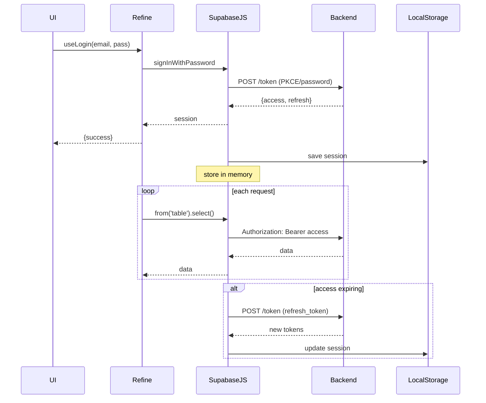

# Как Refine работает с JWT-токенами (на примере Supabase)

**Кратко:**

1) После вызова `authProvider.login` библиот **supabase-js** получает у бэкэнда пару `access_token` / `refresh_token` и автоматически сохраняет объект `session` в `localStorage` (при `persistSession: true`) .  [^1][^2]
2) При каждой новой загрузке страницы Supabase извлекает сессию из `localStorage`, кладёт её в память и подписывается на события обновления токена .  [^2]
3) Все запросы, которые Refine направляет через `dataProvider(supabaseClient)`, выполняет именно **supabase-js**. Она сама добавляет заголовок `Authorization: Bearer <access_token>` или параметр `apikey`, поэтому Refine к `localStorage` не обращается напрямую .  [^3][^4]
4) При истечении срока действия Supabase тихо использует `refresh_token`, обновляет пару токенов, синхронизирует их в памяти и в `localStorage`, а Refine продолжает работать без разрыва сессии .[^2][^5]

## Структура работы

### 1. Получение токена при log in

- В компоненте `<Refine>` вы передаёте объект `authProvider`.
- Вариант, сгенерированный `@refinedev/supabase`, вызывает

```ts
const { data, error } = await supabaseClient
      .auth.signInWithPassword({ email, password });
```

либо `signInWithOAuth`, в зависимости от метода входа .[^6]
- Если авторизация успешна, **supabase-js** возвращает `data.session`, содержащий:
    - `access_token` (JWT)
    - `refresh_token`
    - дату истечения, user и другую служебную информацию .[^5]


### 2. Сохранение сессии

- При инициализации клиента:

```ts
const supabaseClient = createClient(URL, KEY, {
    auth: { persistSession: true }   // опция по умолчанию в браузере
});
```

Supabase использует реализацию `LocalStorageAdapter`, поэтому кладёт сериализованный JSON вида

```
supabase.auth.token => {"currentSession":{...},"expiresAt":...}
```

в `localStorage` .[^2][^7]


### 3. Внутренняя память против localStorage

- **В памяти** браузерного процесса Supabase держит текущий объект `session`.
- При **перезагрузке** страницы выполняется

```ts
supabase.auth.getSession();           // читает LS один раз
supabase.auth.onAuthStateChange(...)  // подписка
```

Таким образом дальнейшие запросы используют **память**, а не `localStorage` .[^2][^5]


### 4. Использование токена при запросах

- В Refine все CRUD-операции (`useList`, `useCreate`, и т. д.) проксируются в `supabaseClient.from(…)` .  [^4]
- **supabase-js** автоматически добавляет действующий `access_token` к каждому HTTP-запросу, потому что хранит его внутри клиента `supabase.auth.session()` .  [^7]
- Вам не нужно вручную извлекать токен, писать интерсепторы Axios или изменять `headers` — достаточно передать настроенный `dataProvider`.


### 5. Обновление (refresh) токена

- Браузерный SDK устанавливает таймер по `expires_in` и за 30 секунд до истечения делает `POST /token?grant_type=refresh_token` .  [^5]
- Новые `access_token` и `refresh_token` поступают в объект `session`, событие `SIGNED_IN` триггерит синхронизацию и перерендер страниц, если вы подписаны через `onAuthStateChange` .[^2]


### 6. Выход из системы

```ts
await supabaseClient.auth.signOut();
```

- Токены удаляются из памяти, из `localStorage`, и Refine перенаправляет на `/login` через реализацию `authProvider.logout` .[^8]


## Диаграмма жизненного цикла сессии




## Ответы на частые вопросы

| Вопрос | Ответ |
| :-- | :-- |
| **Хранится ли JWT в `localStorage`?** | Да, по умолчанию в web-клиенте. Можно заменить хранилище на `IndexedDB`, `sessionStorage` или cookies, передав свой `storage` адаптер в `createClient` [^2][^9]. |
| **Достаёт ли Refine токен из `localStorage` при каждом запросе?** | Нет. После первой загрузки сессия живёт в памяти Supabase-клиента; читать LS повторно не требуется [^2]. |
| **Как добавить токен к чужому fetch/axios?** | Используйте `useGetIdentity`/`useGetToken` вашего `authProvider` или напрямую `supabase.auth.getSession()` и вставьте `Authorization` в заголовок. |
| **Безопасно ли хранить JWT в `localStorage`?** | Это удобно, но подвержено XSS. Для SPA с Supabase можно подключить [auth-helpers] и хранить сессию в `httpOnly` cookie [^9][^10]. |

## Минимальный пример файла `authProvider.ts`

```ts
import { AuthProvider } from "@refinedev/core";
import { supabaseClient } from "./supabaseClient";

export const authProvider: AuthProvider = {
  login: async ({ email, password }) => {
    const { data, error } =
      await supabaseClient.auth.signInWithPassword({ email, password });
    if (error) return { success: false, error };
    return { success: true, redirectTo: "/" };
  },

  logout: async () => {
    await supabaseClient.auth.signOut();
    return { success: true, redirectTo: "/login" };
  },

  check: async () => {
    const { data } = await supabaseClient.auth.getSession();
    return { authenticated: !!data.session };
  },

  getPermissions: async () => null,
  getIdentity: async () => {
    const { data } = await supabaseClient.auth.getUser();
    return data.user
      ? { id: data.user.id, name: data.user.email }
      : null;
  },
};
```


## Практические советы

### Переключение хранилища

```ts
import * as SecureStore from "expo-secure-store";
const supabase = createClient(URL, KEY, {
  auth: {
    storage: {
      getItem: SecureStore.getItemAsync,
      setItem: SecureStore.setItemAsync,
      removeItem: SecureStore.deleteItemAsync,
    },
  },
});
```

Подойдёт для React Native или когда нужна защита от XSS .[^11][^12]

### Настройка авто-refresh на сервере

Для Edge Functions / SSR установите

```ts
auth: { persistSession: false, autoRefreshToken: false }
```

и передавайте токен в заголовках вручную .[^2][^13]

## Итоги

Refine не управляет JWT непосредственно. За получение, хранение, прикрепление и обновление токенов отвечает **supabase-js**. Refine лишь:

- предоставляет обёртку `authProvider` для вызовов Supabase Auth;
- проксирует данные через `dataProvider`, который использует уже аутентифицированный клиент.

Таким образом токены хранятся и обновляются «прозрачно», а ваши Refine-страницы получают защищённый доступ к данным без лишнего кода.

<div style="text-align: center">⁂</div>

[^1]: https://supabase.com/docs/guides/getting-started/quickstarts/refine

[^2]: https://supabase.com/docs/guides/auth/server-side/advanced-guide

[^3]: https://refine.dev/docs/authentication/auth-provider/

[^4]: https://refine.dev/docs/data/packages/supabase/

[^5]: https://supabase.com/docs/guides/auth/sessions

[^6]: https://dev.to/refine/refineweek-setting-up-the-client-app-5722

[^7]: https://stackoverflow.com/questions/76218208/how-do-i-access-supabase-authentication-generated-access-token

[^8]: https://github.com/refinedev/refine/blob/main/examples/auth-antd/src/App.tsx

[^9]: https://egghead.io/lessons/remix-make-cookies-the-user-session-single-source-of-truth-with-supabase-auth-helpers

[^10]: https://github.com/orgs/supabase/discussions/11100

[^11]: https://an7.hashnode.dev/using-supabase-authentication-on-expo

[^12]: https://stackoverflow.com/questions/76591834/supabase-react-native-access-token-not-refreshed-after-a-week-of-inactivity

[^13]: https://github.com/supabase/supabase-js/issues/684

[^14]: https://refine.dev/docs/guides-concepts/authentication/

[^15]: https://discord-questions.refine.dev/m/1326980569317507285

[^16]: https://github.com/hirenf14/refine-auth-kinde-react

[^17]: https://security.stackexchange.com/questions/271157/where-to-store-jwt-refresh-tokens

[^18]: https://stackoverflow.com/questions/44133536/is-it-safe-to-store-a-jwt-in-localstorage-with-reactjs

[^19]: https://supabase.com/docs/guides/getting-started/tutorials/with-refine

[^20]: https://zenstack.dev/blog/refine-dev-backend

[^21]: https://dev.to/jay818/auth-with-jwt-localstorage-2g1g

[^22]: https://github.com/refinedev/refine/discussions/4606

[^23]: https://www.digitalocean.com/community/developer-center/building-and-deploying-an-hr-app-using-refine

[^24]: https://www.descope.com/blog/post/developer-guide-jwt-storage

[^25]: https://dev.to/refine/simple-web-application-example-with-refine-362j

[^26]: https://www.habilelabs.io/blog/all-about-refine-dev

[^27]: https://habr.com/ru/companies/ruvds/articles/512866/

[^28]: https://www.npmjs.com/package/@refinedev/supabase

[^29]: https://supabase.com/partners/refine_dev

[^30]: https://www.reddit.com/r/Supabase/comments/1gowzgq/whats_the_best_practice_for_storing_the_token_for/

[^31]: https://stackoverflow.com/questions/79105525/supabase-auth-callback-asking-for-code-verifier-and-auth-code-again-after-succes

[^32]: https://supabase.com/docs/reference/javascript/v1/auth-setauth

[^33]: https://docs.expo.dev/guides/using-supabase/

[^34]: https://www.reddit.com/r/Supabase/comments/1g6wf5y/supabase_auth_nextjs_13_successful_login_still/

[^35]: https://www.reddit.com/r/Supabase/comments/1b6ty6y/superbase_auth_storing_tokens_in_local_storage/

[^36]: https://authjs.dev/getting-started/adapters/supabase

[^37]: https://github.com/orgs/supabase/discussions/21824

[^38]: https://supabase.com/pricing

[^39]: https://github.com/supabase/supabase-js/issues/254

[^40]: https://stackoverflow.com/questions/76755864/supabase-not-storing-session-data-in-localstorage-correctly

[^41]: https://forum.bubble.io/t/new-plugin-supabase-js-with-auth-data-and-storage/267704?page=7

[^42]: https://www.npmjs.com/package/@dotted-labs/ngx-supabase-auth

[^43]: https://www.reddit.com/r/Supabase/comments/14yam51/help_session_returning_null_looking_for_a_a_guide/

[^44]: https://stackoverflow.com/questions/68332321/supabase-third-party-oauth-providers-are-returning-null

